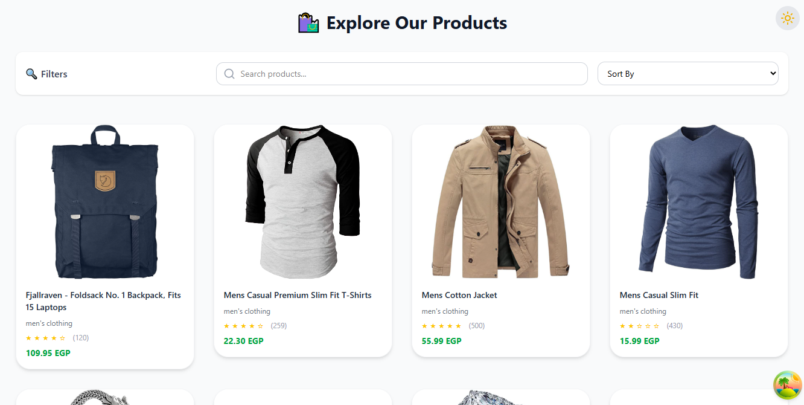
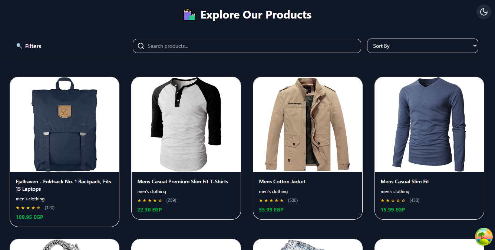
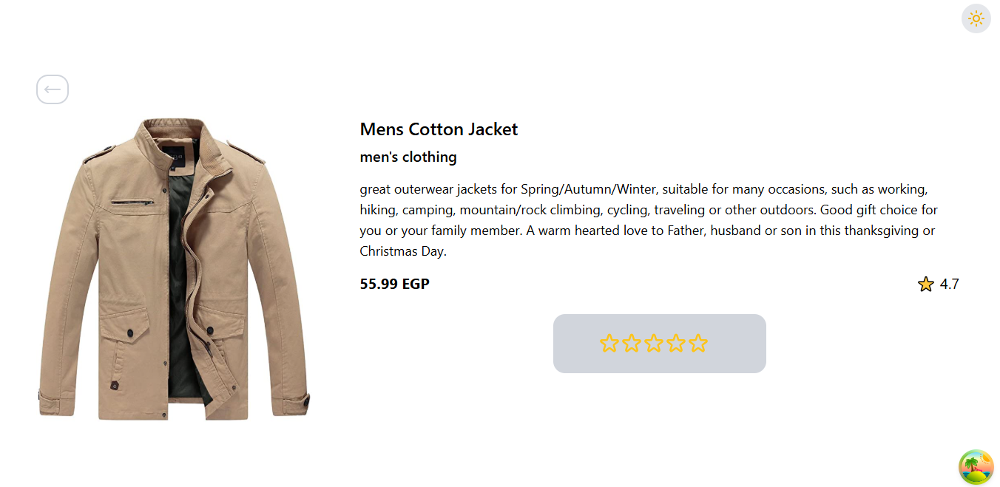
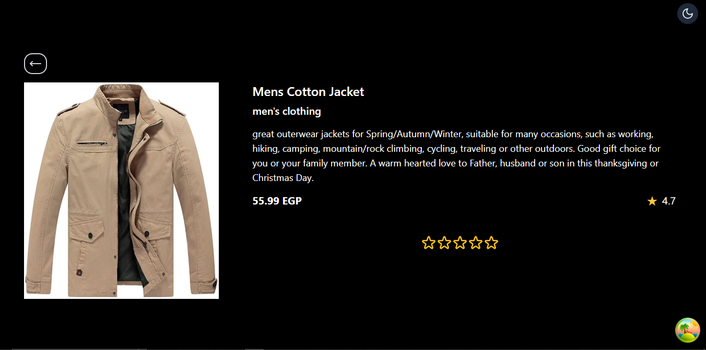

# 🛍 Products Gallery Web Application

A fully responsive, dynamic, and modern e-commerce product gallery built with _React 18, **Tailwind CSS, and the **Fake Store API_.  
The app allows users to _browse, **filter, **sort, and \*\*view details_ of products in a seamless, stylish interface with _Light/Dark mode toggle_ and _local rating per product_.

---

## 🚀 Live Demo

🔗 [Click here to view the live project](https://products-gallery-one.vercel.app/)

---

## 🎯 Features

- 🔄 _Dynamic Routing_ for product details (/products/:id)
- 🌐 _Data Fetching_ from [FakeStoreAPI](https://fakestoreapi.com/products)
- 🎨 _Dark / Light Mode_ toggle (saved in localStorage)
- ⭐ _User Rating_: Rate each product individually (rating stored locally)
- 🔍 _Search_: Case-insensitive product name filtering
- 🔃 _Sorting_: By price (Low→High / High→Low) or title (A→Z)
- 🖼 _Responsive Product Cards_
- ⚠ _Error Boundaries_ and _Fallback UI_ for failed API calls
- 📱 _Fully responsive layout_ using Tailwind CSS
- 🕓 _Loading indicators_ and clean empty states

---

## 📸 Screenshots

| Light Mode                      | Dark Mode                         |
| ------------------------------- | --------------------------------- |
|  |     |
|     |  |

---

## 🧩 Tech Stack

- _React 18_
- _Tailwind CSS_
- _React Router v6_
- _Context API_ for Theme
- _LocalStorage_ (Dark mode & Rating persistence)
- _Axios_ for data fetching

---

## 🧠 Project Structure

ProductsPage/
├── node_modules/
├── public/
├── src/
│ ├── assets/
│ │ ├── 3737258.jpg
│ │ └── react.svg
│ ├── Context/
│ │ └── Theme.context.jsx
│ ├── Error/
│ │ └── Error.jsx
│ ├── Home/
│ │ ├── HomePage.jsx
│ │ └── SkeletonLoaderHome.jsx
│ ├── layout/
│ │ └── Layout.jsx
│ ├── ProductDetails/
│ │ ├── ProductDetails.jsx
│ │ └── SkeletonLoader.jsx
│ ├── Rating/
│ │ └── StarRating.jsx
│ ├── App.jsx
│ ├── index.css
│ └── main.jsx
├── .gitignore
├── eslint.config.js
├── index.html
├── package-lock.json
└── package.json

---

## ⚙ How to Run Locally

```bash
git clone https://github.com/ahmedmostafa-io/products-gallery.git
cd products-gallery
npm install
npm run dev


---

✅ Future Improvements

🛒 Add Cart with quantity handling

🧾 Add Checkout flow

❤ Add Wishlist feature (persisted)

🔐 Add user authentication


---

## 👨‍💻 Author

Ahmed Mostafa Ahmed Abdel-Aal
[GitHub](https://github.com/ahmedmostafa-io) | [LinkedIn](https://www.linkedin.com/in/ahmed-mostafa-582378373/)
📍 Cairo, Egypt


---
```
